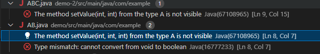

# Reproduction vscode java diagnostic bug

In some case the java diagnostic takes the function signature from the wrong class/interface.

see examples:
- demo 1: [demo-1/src/main/java/com/example/AB.java](./demo-1/src/main/java/com/example/AB.java)
- demo 2: [demo-2/src/main/java/com/example/ABC.java](./demo-2/src/main/java/com/example/ABC.java)

